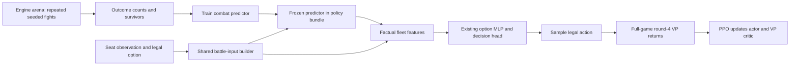

# Battle arena design: mechanics knowledge inside the main policy

> Latest user clarification and executable handoff:
> [BATTLE_ARENA_AGENT_HANDOFF_2026-09-16.md](BATTLE_ARENA_AGENT_HANDOFF_2026-09-16.md).
> The arena is isolated pitched battles varying fleets, upgrades and factions,
> optionally action-card hands. Restricted V1 below is a smoke subset, not the
> intended final domain. Movement integration/audits are downstream work. The
> handoff supersedes conflicting scope, fixed input dimensions and ordering below.

> **2026-09-17, user decision:** §6's "never substitute an independent implementation of dice or
> sustain rules" is overridden. Labels come from the two-fleet simulator in
> `ti4-training::battle_arena`, kept honest by checks against the engine and against ti4calc. Battle
> facts use the existing `action-plan` family rather than a new `battle:*` family. See
> [evidence/ARENA_002_PREDICTOR_2026-09-17.md](evidence/ARENA_002_PREDICTOR_2026-09-17.md).

Status: design specification, not implemented. Companion to
`BATTLE_ARENA_PLAN_2026-09-16.md`. The first implementation remains ARENA-001.
Full-game training and evaluation end by round 4. This design does not change
the PPO reward, the VP critic target, or the engine's combat rules.

## 1. Architecture decision

Use a small pretrained combat predictor as a **frozen component of the complete
policy bundle**. Feed its option-specific predictions, alongside factual fleet
inputs, into the existing actor's sparse input layer. PPO learns how to use them
for VP. The predictor does not choose attacks and does not bypass legal options.

This is the initial integration, rather than pretraining only the existing combat
action head. That head answers casualties/retreats; it does not itself choose an
activation or move. A disconnected battle classifier would likewise provide no
benefit unless its result reaches the relevant decision inputs.



Arena simulation and live play share the typed battle-input contract and feature
emitter. Training is batched; live inference remains CPU-local to each rollout
worker. No simulation or GPU request queue is introduced into a decision.

## 2. What the current model permits

`MlpBot::decide` projects each option, converts named features to `SparseOption`,
then calls `Actor::probabilities`. `Actor::trunk` reduces sparse input embeddings,
applies the shared trunk and then the decision/faction readout. Consequently:

- A new bounded feature can affect any intended action head through the shared
  input table without creating another action sampler.
- A battle estimate must describe **that option**. One estimate copied onto every
  move fails to describe what each move changes.
- `ppo::Step.options` already stores the actual sparse inputs used by the behavior
  policy. Materialized battle features can travel through existing PPO math.
- Arena examples must not be inserted as PPO Steps: they have no full-game
  behavior distribution or four-round VP return.

Existing unit-option features include unit statistics and damage information;
the audit must measure missing *two-fleet context*, not assume all unit knowledge
is absent. Existing vocabulary uses OOV registry v11, bundle schemas 7–10 and
projection ABIs 2/3. Assign new versions through reviewed migrations; do not edit
the semantics of those existing versions or silently use OOV slots for battle data.

## 3. Versioned contracts and ownership

The names below are proposed APIs, not functions already in the repository.

| Contract | Contents | Proposed owner |
|---|---|---|
| `BattleInputV1` | Canonical attacker/defender fleet counts; public scope; rules and continuation-policy identity | `ti4-policy::battle` |
| `BattleQuery` | Applicable supported input, publicly unsupported reason, or not applicable | `ti4-policy::battle` |
| `ArenaScenarioV1` | Input plus simulator construction recipe, split/family ID, bounded seed panel | `ti4-training::battle_arena` |
| `ArenaOutcomeV1` | Completed outcome, survivor counts/damage, combat rounds; typed failure separately | `ti4-training::battle_arena` |
| `BattlePredictionV1` | Three outcome probabilities and expected survivor counts/damage | `ti4-policy::battle` |
| `BattlePredictor` | Frozen weights, normalization and validated input/output contract | `ti4-mlp::battle` |
| `BattleFeatureEmitter` | Closed, actor-relative named facts and predictions for each option | `ti4-policy::battle` |

Dependencies stay acyclic: policy defines tensor-free contracts; training uses
policy and engine to generate labels; mlp uses policy to train/serve the predictor.
The live policy crate must not depend on mlp or training. A trainer example may use
ti4-training through ti4-mlp's existing development dependency.

Data manifests record schema, feature semantics, content/rules hash, seed scheme,
continuation policy, canonicalization, normalization, split membership and source
provenance. Predictor identity includes all of these plus weights. No raw player,
system or unit-instance identity is a learned input.

## 4. V1 battle domain and input representation

Start with five base types: fighter, destroyer, cruiser, carrier and dreadnought.
For each side, store healthy and damaged counts in a fixed type order: 20 numeric
inputs. Damage on a type without sustain is invalid. Initial limit: at most 16
ships per side; reject out-of-range examples rather than clamp different fleets
into the same vector. The limit is a pilot coverage bound, not a game rule.

V1 has no upgrades, faction combat effects, galvanized units, war suns, flagships,
ground cargo, external fire, anomalies or retreats. Validate initial capacity and
fleet supply through the engine. Engine consequences of carrier loss and fighter
capacity remain part of resolution and the recorded survivor definition; the
harness must pin the exact post-combat settlement boundary it includes.

Versioned context fixes a normal system and a deterministic casualty/sustain policy
for each side. These context IDs select/validate the predictor; they are not free
numeric features to which unseen values can be silently assigned. V2 can add
public upgrades and modifiers only alongside labeled coverage and a schema change.

**Interpretation:** predictions describe the declared ordinary-combat continuation
without discretionary card/leader intervention. They are not unconditional actual
game odds against an opponent's private hand. Apply that interpretation identically
in training and live play. The live support decision must never inspect hidden
cards, including merely to decide whether a prediction is available. Known public
effects outside scope yield a public unsupported reason. An ordinary baseline
estimate cannot be mislabeled as fully modeling a special-mechanic fight.

The live builder takes `SeatObservation` plus the legal choice/option, never an
unrestricted simulator state. Offline construction may own full state, but must
emit the same actor-visible input. Changing an opponent's private hand alone must
not change inputs, support flags or predictions.

## 5. First policy surface: incremental movement

The first live integration is the movement head, including `done_moving`. It has
a known activated destination and an actual candidate move. Activation comes later
because it has not yet committed a fleet.

Define `current` as the friendly force already committed to the destination and
`candidate(option)` as the legally resulting committed force if this move is taken.
Resolve the actual unit/manifest through typed engine information; do not infer a
unit by display text, assume a payload index is stable after mutation, or assume
all cargo is known. If the visible retained movement state is insufficient, add a
narrow factual engine projection and test it; do not simulate by guesswork.

For each supported option ask: **how would this battle resolve if movement ended
with that resulting fleet, under the declared continuation?** This conditional
meaning also applies when more legal ships could still be added afterward.

- `done_moving`: candidate is the current committed fleet.
- A ship move: candidate is current plus the exact moved unit and resolved cargo.
- Unknown future cargo/commitment: no prediction until supported; do not pretend
  an empty carrier includes fighters or infantry waiting at its origin.
- No opposing fleet: mark not applicable. Do not call the network or invent a
  100% combat win feature for peaceful expansion.
- Empty current fleet with a nonempty supported candidate: score the candidate;
  mark baseline/delta unavailable rather than score an impossible empty battle.

Example: two enemy cruisers defend a destination. Moving a dreadnought and moving
a carrier must produce different candidate vectors even though both add one hull.
Once the dreadnought is committed, the next carrier option describes dreadnought
plus carrier; `done_moving` describes the dreadnought alone. A third friendly fleet
elsewhere is not silently included. These become end-to-end acceptance fixtures.

Expose closed `battle:*` features, normalized under the versioned contract:

- applicable, supported, and baseline-available flags;
- candidate own/enemy healthy/damaged counts per type;
- own-win, enemy-win, mutual-destruction probabilities;
- expected own/enemy surviving counts by type and damage;
- supported candidate-minus-current outcome changes where both queries exist.

Map attacker/defender predictions into the acting seat's perspective explicitly.
Unsupported inputs carry factual counts only where valid plus support flags;
prediction fields are absent. A missing estimate is not the same as zero win odds.
No hand-authored rule tells PPO which probability merits an attack.

Preserve existing origin/cargo/VP/remaining-action context. This information prices
the opportunity cost of moving a ship. Battle inputs alone cannot tell whether
its origin becomes undefended or whether this attack wastes the last scoring action.

## 6. Arena resolution and targets

Construct bounded legal ordinary-combat states and drive the real retained combat
window through validated decisions. Existing `combat::resolve` can be used for
the simple subset only after equivalence tests establish its relevant settlement
boundary. Never substitute an independent implementation of dice or sustain rules.

V1 uses a versioned explicit legal policy for casualties and sustain. Select
choices by semantic unit facts with a deterministic tie-break; no display text or
first-option dependency. Record the exact policy before producing any labels.
Choose its ordering in ARENA-001, test transport consequences, and report sensitivity
to a second policy. The predictor is conditional on this continuation, not an
optimal-combat oracle or a model of the current PPO bot's every combat choice.

Group scenarios before repetitions: all relabels, side-swapped variants and nearby
fleet-family variants stay in their assigned split. Store integer outcome counts,
number of completions, survivor sums/squared sums and individual failure records.
Seeds control dice independently of worker scheduling. Unfinished combat is an
error class, never a draw or a silently discarded difficult scenario.

Train with outcome-count likelihood plus a separately reported survivor loss.
Keep means and uncertainty distinct: survivor variance due to dice is not model
confidence. Coverage flags are domain checks, not learned certainty estimates.

Initial candidate network: fixed normalized input → 32-unit ReLU → 32-unit ReLU →
outcome and survivor readouts. Compare it with the cheap baselines in the plan;
this size is a starting hypothesis, not a tuned requirement. Softmax gives three
probabilities. For each side/type predict survival fraction and damaged fraction
of survivors, so healthy plus damaged cannot exceed the starting type count.
Mask impossible damage categories. Do not force exact attacker/defender symmetry
without verifying the rules and casualty-policy semantics.

## 7. Main-model training, storage and repeatability

### Materialized-input integration

Introduce one shared decision-preparation path used by live play, evaluations,
capture and offline replay:

```text
existing projected option features
    + actor-visible candidate battle queries
    + frozen predictor outputs (deduplicated within the decision)
    -> one battle feature emitter
    -> vocabulary lookup
    -> SparseOption list in original legal-option order
    -> existing actor, sampling and PPO recording
```

The predictor is loaded once per worker with the inference snapshot and stays
frozen through rollout and all PPO epochs. Store the exact augmented sparse
options in `Step`; do not recompute battle features during PPO optimization.
Behavior log probabilities continue to come from the distribution actually sampled.
Include predictor identity in experiment/capture/checkpoint provenance. Legacy
captures without reconstructible observations cannot acquire battle features by
guessing; retain them as explicitly baseline-only data or regenerate them.

### Checkpoint migration

Add an explicit arena-capable bundle capability/schema and projection version.
New bundles include the predictor's checksummed weights, input contract and
continuation-policy identity inside the existing atomic bundle publication protocol.
An arena-capable bundle with missing or incompatible predictor data fails loading;
it must not silently become the baseline policy. Old bundles retain old behavior.

Extend the closed feature registry/vocabulary with reviewed migration mappings.
Zero-initialize new input rows, remap existing rows and Adam moments correctly,
and preserve/zero separate-critic rows as its schema requires. Test policy logits,
probabilities and value outputs on fixed observations before any PPO update.
The migration must also cover save/load and optimizer resume, not just inference.
Reserve final schema numbers at implementation after checking concurrent changes.

### Why freeze first

Freezing isolates whether useful battle information improves the policy. Updating
the predictor during PPO would add moving input semantics and training interference.
Direct auxiliary training of the shared actor trunk remains a later ablation,
using a separate loss and dataset, never fabricated PPO samples. Distilling the
predictor away is also optional future work if CPU inference overhead proves material.

## 8. Performance and acceptance fixtures

Collect all supported candidate queries in legal-option order, deduplicate them
by canonical input plus predictor/continuation identity, and batch their small
CPU inference once per decision. Reuse a query across options only when the entire
input matches. Start with decision-local caching; no unbounded global cache or
cache depending on a mutable game pointer. Measure preparation, prediction and
total rollout time separately. Retain the plan's 5% overhead screening target.

First fixtures and invariants:

| Fixture | Required result |
|---|---|
| Same count, carrier versus dreadnought | Different actual projected candidate features |
| Healthy versus damaged dreadnought | Different input; no invalid damaged basic unit |
| Ship already committed, next move, done | Correct three candidate fleets and stable option order |
| Unrelated remote fleet added | Candidate unchanged unless the legal move itself changes |
| Hidden opponent hand changes | Input, applicability and support unchanged |
| Player/system relabel | Canonical input and prediction unchanged |
| Public unsupported modifier / oversized fleet | Explicit support failure; no clamping or guessed odds |
| Peaceful destination | No battle prediction; ordinary action features preserved |
| Same scenario/seed on different workers | Same completion, choices and survivor records |
| Sibling scenarios across split boundaries | Rejected by family/split validation |
| Old bundle / migrated zero-weight bundle | Same baseline behavior before learning |
| Record, optimize, reload, resume | Exact feature identity and fixed predictor provenance preserved |

Add holdout prediction tests, finite/normalized outputs, failure/refusal tests and
complete four-round games before accepting integration. Predictor calibration is
necessary but the final pass condition remains equal-total-time round-4 VP gain
against both baseline PPO and a factual-fleet-input-only control.

## 9. First implementation boundary

Implement ARENA-001 before modifying PPO or checkpoint schemas:

1. Tensor-free typed input/support contract and canonical encoder in `ti4-policy`.
2. Actor-visible movement query audit with the concrete fixtures above; report any
   missing engine projection rather than inventing commitment/cargo state.
3. A `ti4-training` arena generator with explicit scope validation, seeded engine
   execution and raw labels. Start at 128 scenarios × 32 seeds, five-minute cap.
4. Evidence: input collisions, supported fraction of real four-round movement
   decisions, error ledger, reproducibility and fights/second.

Unsupported coverage may initially be low because upgrades/faction effects/cargo
matter. If the audit shows too little real coverage, extend the schema and labeled
domain before training or connecting the predictor. Do not hide the coverage gap
by evaluating only idealized examples.

This design adds no generic arena framework, new crate, new worktree or long training
run. Source implementation and independent architecture/math review are still pending.
Only after the generator/input gates pass does ARENA-002 train the predictor; only
after its held-out gate passes does ARENA-003 alter the main-model bundle/projection.
